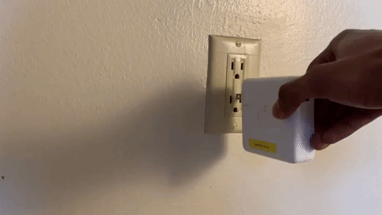

### Plastic Grounding Plug insert for Macbook Chargers 

The standard outlets used in North America [suck](https://youtu.be/6Dd6_TghcE0?t=436)

I don't know why Apple does not supply NEMA 5-15P (3 prong plug including a grounding pin) plugs. So I made a plastic version to actually make my adapter stay. 

### Before

### After

